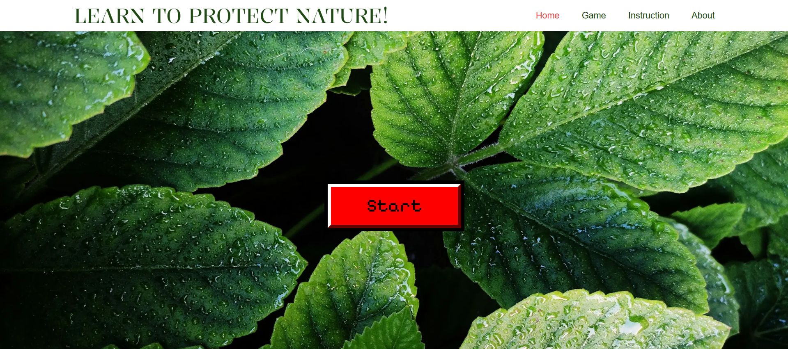
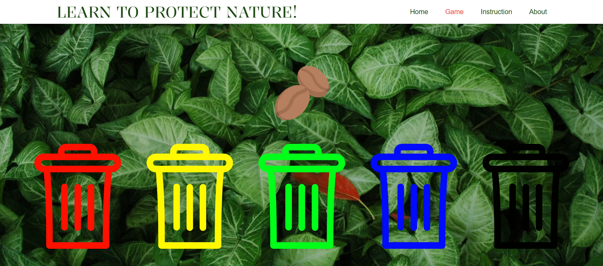
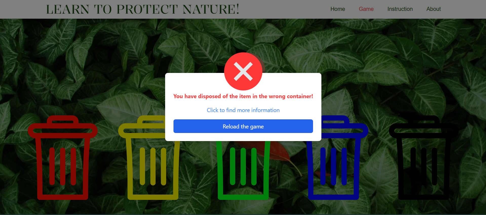
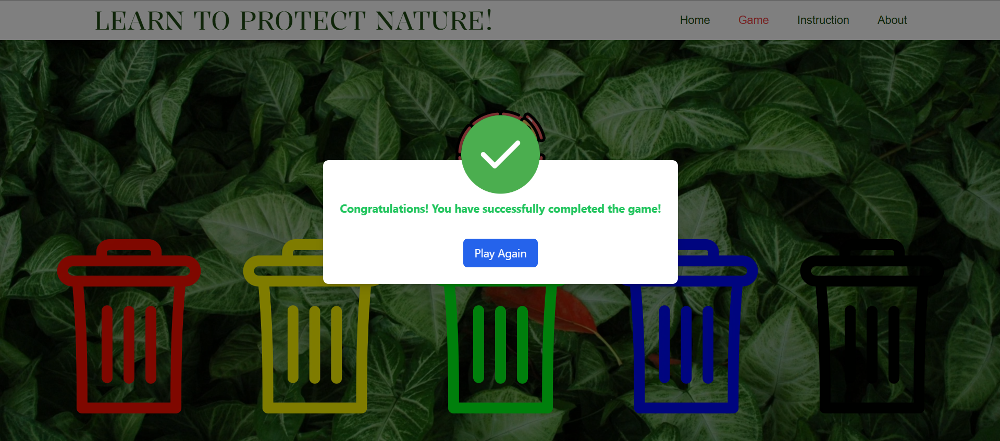
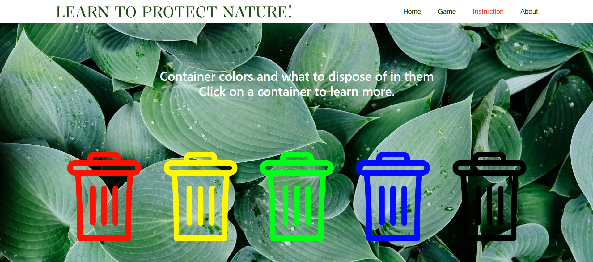
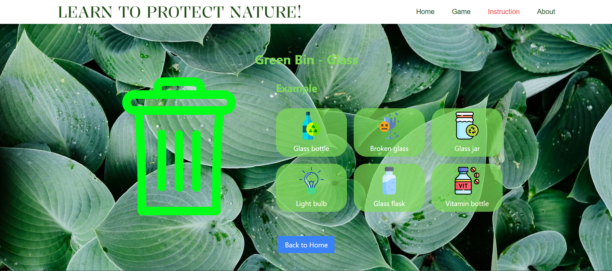
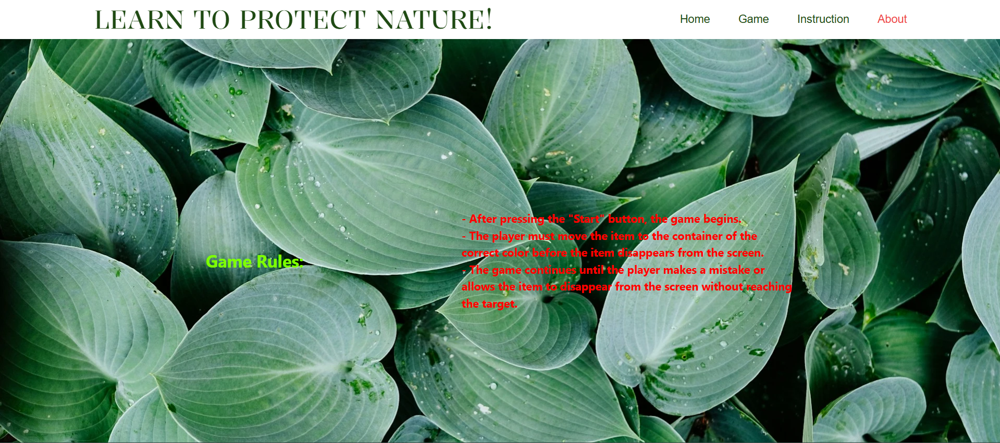

# Ecology VUE

## Interactive Educational Game Built with Vue.js

**Ecology VUE** is an educational web app developed using **Vue.js**, designed to teach users how to properly sort waste into the correct bins.  
Through a simple and engaging game format, users learn what type of trash belongs in which bin, promoting better recycling habits and contributing to a cleaner environment.

---

## 🏠 Home Page

## 🎮 Game Page

## ❌ Incorrect Move

## ✅ Correct Move

## 📘 Instructions Page

## 🗑️ Bin Description Page

## 📋 Game Rules

---

## 🔗 Live Website

[Try the game here](https://ecology-vue.vercel.app/)